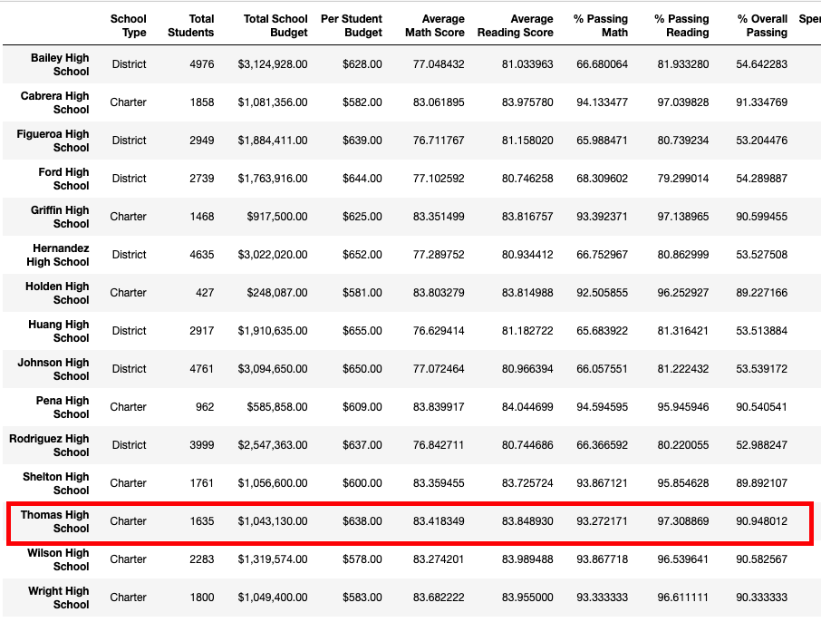

# School_District_Analysis
## Overiew of Project
The School district requested to review the date summaries related to the standardized test scores, because they found out that the test score for ninth grade students were incorrect. Following further debate, it was decided that just the ninth grade math and reading scores at Thomas High School should be replaced, and remains intact with all other information about this student group. 
For 461 student records, both reading and math scores were replaced with "NaN," which stands for "Not-a-Number." Although this may appear to be a relevant number, this replacement had little impact on data summaries overall.

## Purpose
The project main purpose is to analyze students grades and fundings related to the entire School District. By analyzing the data base it allow us to get insights to provide a better performance visibility for each the school under the district. 
Moreover, to uphold state-testing standards, the analyses were stablished twice in order to mitigate potential academic dishonesty for some students. However, the impact of omitting dishonest data was discussed.

## Results
- District summary.
The annulled test scores affect the updated district summary. The passing rate for reading scores decreased by 0.3%, from 86% to 85.7%. The passing rate for math scores declined from 75% to 74.8%, a difference of only 0.2%. Overall, the passing percentage dropped less than 0.1%

### Original district summary

### New district summary

- School summary.
The school summary has been updated to show the removal of the ninth-grade test scores for Thomas High Scholl.
The low district impact overall reported in the previous analyses related to this specific 9th-grade level was not a surprise for me. On the other hand, it is impressive to discover that the removed scores had impacted the passing percentages. Reading pass rates dropped from 84% to 83.9%, a difference of less than 0.1%. Math scores dropped from 93.3% to 93.2%, a difference of less than 0.1%. Overall, the passing percentage dropped by 0.3%.

- How does replacing the ninth graders’ math and reading scores affect Thomas High School’s performance relative to the other schools?

Thomas High School was listed among the top five best performing schools before its 9th-grade test scores replacement. It came in second place. It was still the second-best performing school after removing the ninth-grade score data. Its overall passing percentage barely decreased by 0.4%, from 91% to 90.6%.

- How does replacing the ninth-grade scores affect the following?

The grade of math and reading scores were modest impacted. The difference between 9-12th grade vs 10-12th grade was less than 0.1-0.4%. The table outcome remains similar.  
The impact on the school spending summary was zero, given that the total budget per school did not suffer any change. The spending view per student was unaffected because the student count values were not removed.
The scores thorough school size had the 9th-grade test scores had zero impact on the school sizes. The size for each school remains the same because no other data was removed.
The score through the school type had the overall passing percentage less than 0.1-0.4%, basically, the outcome table had no significant change.

## Summary
There are four main changes in the ninth grade at Thomas High School due to the reading and math score replacement with NaNs.
- First, a Thomas High School ranking decreased compared with other schools in the district. 
- Second, the passing percentage decreased for reading and math, which impacted spending. 
- Third, the students population decreased impacting the passing rate. 
- The last, Thomas High School had the overall passing percentage decreased.

#

**Contact:**
**E-mail:** mciano@hotmail.co.uk

**LinkedIn:** https://www.linkedin.com/in/marciorciano/

#